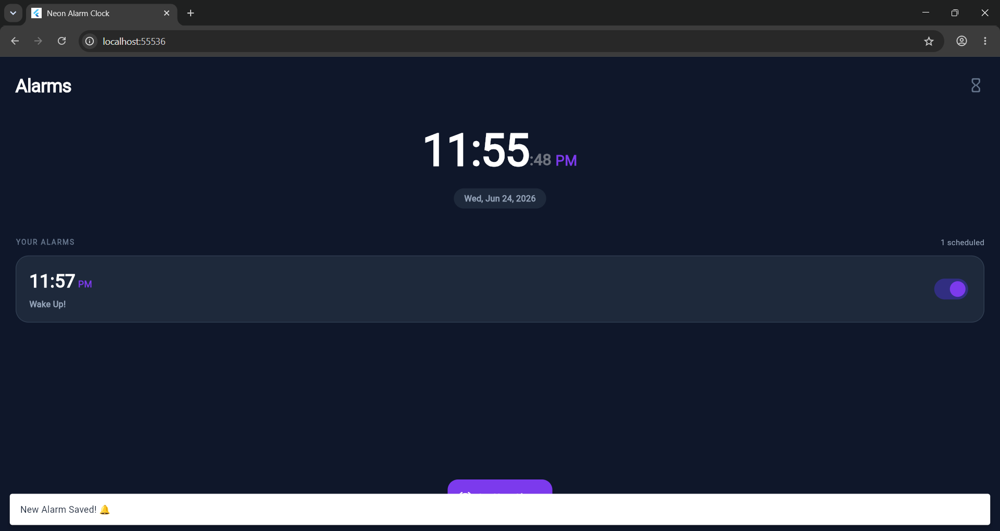
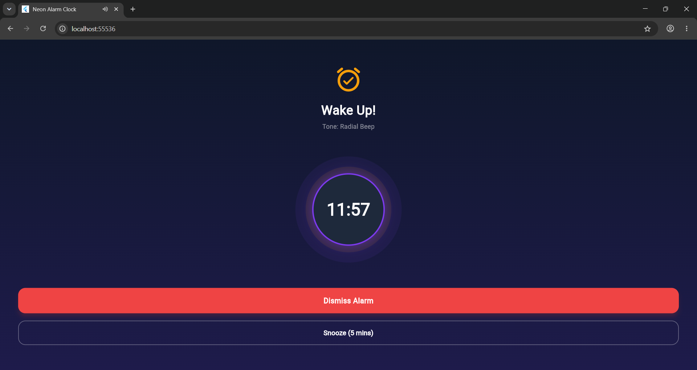

# CODSOFT Android App Development Internship

This repository contains my submissions for the **CodSoft Android App Development Internship**. It includes three premium, fully functional applications built with Flutter and Dart, focused on clean architecture, local storage data persistence, custom styling, and optimal performance.

## 📁 Repository Structure

The project is structured into three self-contained Flutter application workspaces:

```
CODSOFT/
├── README.md                 # Master documentation
├── task1_todo_list/          # Task 1: TaskFlow To-Do List Application
│   ├── README.md             # Task 1 specific documentation
│   └── outputs/              # Task 1 output previews
├── task2_quote_of_the_day/   # Task 2: DQuotes Daily Quote Application
│   ├── README.md             # Task 2 specific documentation
│   └── outputs/              # Task 2 output previews
└── task3_alarm_clock/        # Task 3: Neon Alarm Clock Application
    ├── README.md             # Task 3 specific documentation
    └── outputs/              # Task 3 output previews
```

---

## 🛠️ Applications Overview

### 1. Task 1: TaskFlow (To-Do List App)
A productivity-focused task manager featuring advanced classification, priorities, and data persistence.
*   **Key Features**: Priority badges (Low, Medium, High), date picker with live **Overdue** highlighting, status filter tabs (All, Active, Completed), text edits, and swipe-to-delete.
*   **Theme**: Clean Emerald Green & Slate.
*   **Data Store**: Persistent locally using `SharedPreferences`.

### 2. Task 2: DQuotes (Quote of the Day App)
An inspiring daily quotes engine supporting discovery, favorites, and sharing.
*   **Key Features**: Deterministic daily quote generator, live search by author/category, category browse chips, clipboard copying, native social share drawer, and local favorites bookmarker.
*   **Theme**: Vibrant Indigo-Violet & Purple gradients.
*   **Data Store**: Persistent favorites via `SharedPreferences`.

### 3. Task 3: Neon Alarm Clock App
A modern bedside digital alarm dashboard with active alarm triggering and snooze management.
*   **Key Features**: Live digital ticking clock with seconds, repeat day selectors, persistent active switches, custom Web Audio API synthesizer for 4 ringtones, and a pulsating ringing interface with **Snooze** and **Dismiss** controls.
*   **Theme**: Midnight Slate & Indigo with glowing Amber/Crimson accents.
*   **Data Store**: Persistent alarms database.

---

## 🚀 Getting Started

### Prerequisites
Make sure you have Flutter SDK installed and configured on your system:
- **Flutter SDK**: `^3.35.0` or higher
- **Dart SDK**: `^3.0.0` or higher
- **Web Browser**: Google Chrome (for web target testing)

### Installation & Execution
To run any of the applications, navigate into the respective task directory in your terminal and execute:

```bash
# 1. Navigate to the task directory
cd task1_todo_list           # Or task2_quote_of_the_day / task3_alarm_clock

# 2. Fetch project dependencies
flutter pub get

# 3. Run the application
flutter run -d chrome        # Runs the app on Google Chrome
```

---

## 📸 Output Previews

| Task | Output Preview 1 | Output Preview 2 |
|---|---|---|
| **Task 1: To-Do List** |  |  |
| **Task 2: Daily Quotes** |  |  |
| **Task 3: Alarm Clock** |  |  |

---

## 👤 Developer
*   **Name**: Md Rounaq Ali
*   **Internship**: Android App Development Intern at CodSoft
