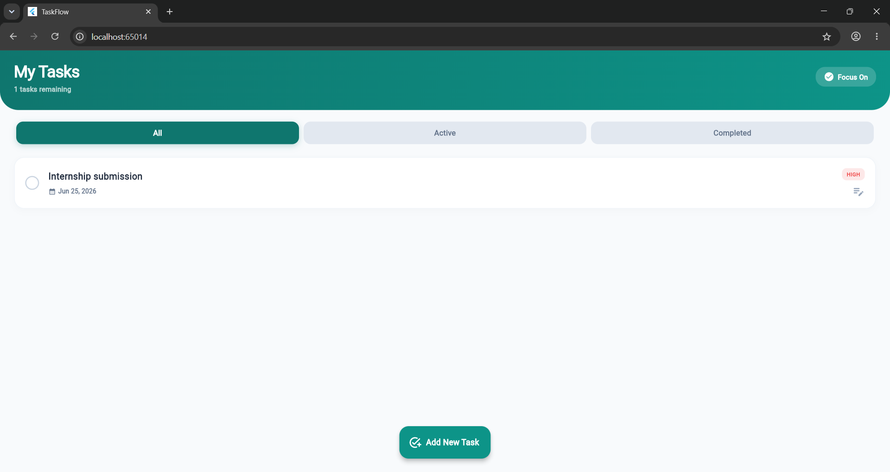
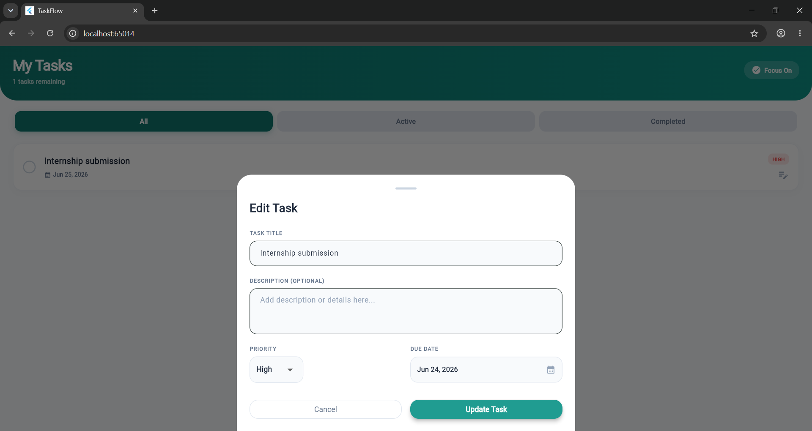

# Task 1: TaskFlow (To-Do List App)

TaskFlow is a clean, modern, and productivity-focused to-do list manager built with Flutter. It helps users organize their daily schedules efficiently by providing priority ratings, calendar due dates, status filtering, and secure local data persistence.

## ✨ Features

- **Task Creation**: Add tasks with titles and detailed descriptions.
- **Priority Classifications**: Classify tasks into `High`, `Medium`, and `Low` priority tags.
- **Due Dates & Overdue Checking**: Choose due dates using a date picker. Overdue tasks are automatically styled with red alerts.
- **Status Filter Tabs**: Instantly filter and view tasks based on status:
  - `All`: View every active and completed task.
  - `Active`: Show only pending tasks.
  - `Completed`: Show completed tasks with clean line-through text.
- **Local Persistence**: Saves all task items locally on the device using `SharedPreferences` to ensure they persist across app restarts.
- **Interactive Management**: Mark tasks complete/active with checkbox buttons, perform detailed inline edits, or swipe-left to delete.

## 🛠️ Tech Stack & Packages

- **Framework**: Flutter (Dart)
- **State Management**: ChangeNotifier (Provider pattern)
- **Local Storage**: `shared_preferences`
- **Data Formatting**: `intl`

## 🚀 How to Run

1. Navigate to the Task 1 directory:
   ```bash
   cd task1_todo_list
   ```
2. Get dependencies:
   ```bash
   flutter pub get
   ```
3. Run on Chrome (or emulator/device):
   ```bash
   flutter run -d chrome
   ```

---

## 📸 Output Previews

> [!TIP]
> Place your actual output images inside the `task1_todo_list/outputs/` folder named `dashboard.png` and `editor.png`.

### 1. Main Dashboard View
Displays the active tasks, priority tags, and category tabs:


### 2. Task Creator & Editor Modal
Interface showing the custom picker details:

