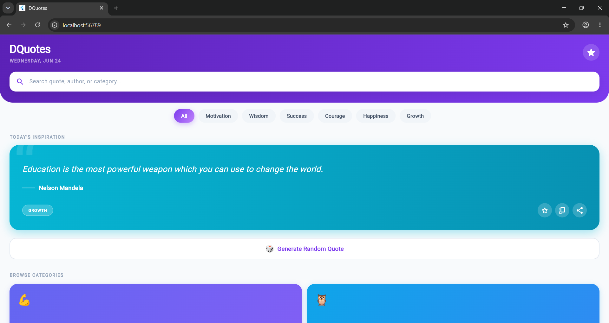
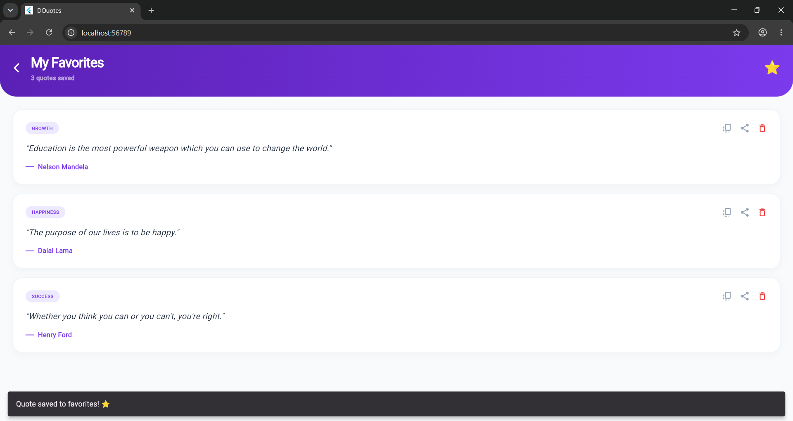

# Task 2: DQuotes (Quote of the Day App)

DQuotes is an inspiring, modern, and visually engaging quote generator application built with Flutter. It displays a fresh quote of the day, supports browsing by category, searching quotes/authors, copying, social sharing, and bookmarking favorites.

## ✨ Features

- **Daily Inspiring Quote**: Automatically computes and presents a unique daily quote using day-of-year calculations.
- **Random Generator**: Shake up the routine by tapping the **"Generate Random Quote"** button to load a new quote from the active selection.
- **Categorized Gradients**: Browse and select from 6 topics: `Motivation`, `Wisdom`, `Success`, `Courage`, `Happiness`, and `Growth`. Each category applies a unique, vibrant gradient theme.
- **Instant Search**: Search through quotes, authors, or categories with live results.
- **Social Sharing**: Share full quotes directly to WhatsApp, Instagram, Telegram, or Gmail via native system share drawers.
- **Copy to Clipboard**: Copy text to your clipboard with one tap.
- **Persistent Favorites**: Star your favorite quotes to store them in a secure local database (via `SharedPreferences`), complete with a dedicated Favorites manager screen.

## 🛠️ Tech Stack & Packages

- **Framework**: Flutter (Dart)
- **Local Storage**: `shared_preferences`
- **Social Sharing**: `share_plus`
- **Data Formatting**: `intl`

## 🚀 How to Run

1. Navigate to the Task 2 directory:
   ```bash
   cd task2_quote_of_the_day
   ```
2. Get dependencies:
   ```bash
   flutter pub get
   ```
3. Run on Chrome (or emulator/device):
   ```bash
   flutter run -d chrome
   ```

---

## 📸 Output Previews

> [!TIP]
> Place your actual output images inside the `task2_quote_of_the_day/outputs/` folder named `home.png` and `favorites.png`.

### 1. Home Dashboard & Quote Cards
Displays the quote of the day with custom gradients and tags:


### 2. Favorites List
Manager view displaying all bookmarked quotes:

